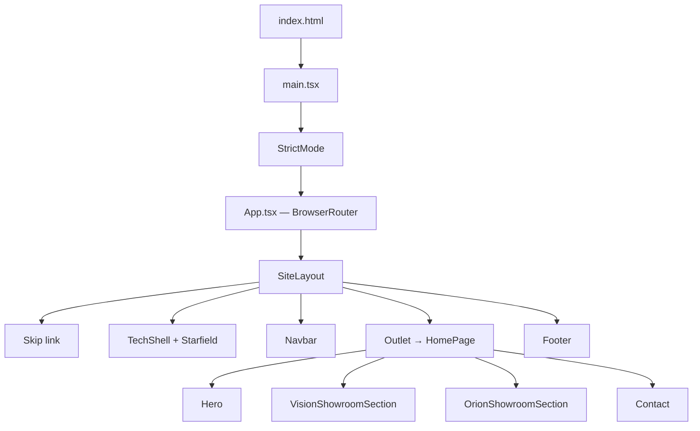
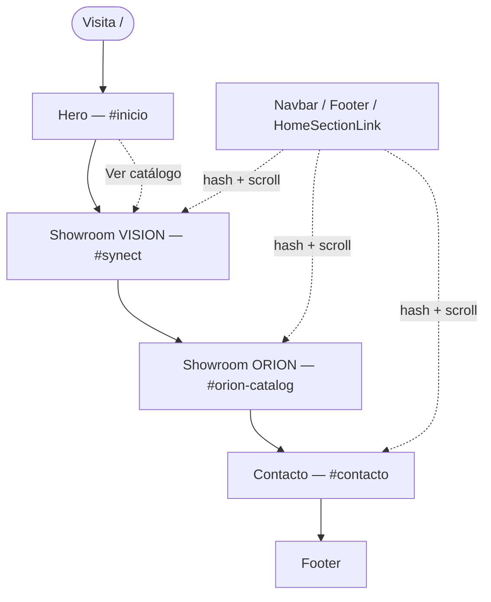
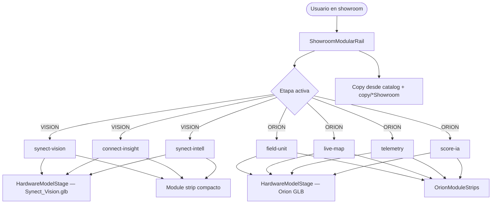
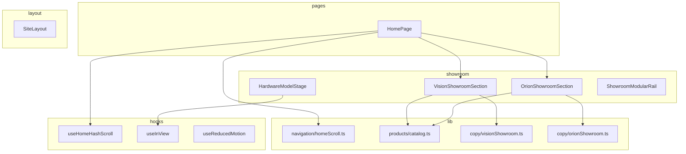
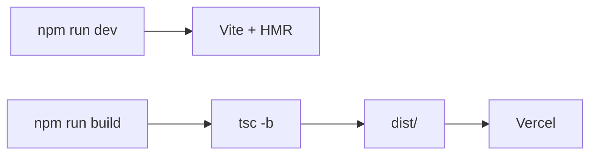

# Diagrama de flujo — Web SynecT

Referencia del flujo de la landing actual: arquitectura, navegación e interacciones.

> **Nota:** La versión anterior incluía secciones (`SocialProof`, `SynectEcosystem`, `Solutions`, etc.) y un archivo `DIAGRAMA-FLUJO.drawio` ya retirado. Este documento refleja el código en `src/` a partir de la landing tipo showroom.

---

## 1. Resumen

| Aspecto | Detalle |
|---------|---------|
| **Tipo** | SPA — una página principal con scroll vertical |
| **Stack** | React 19 + TypeScript + Vite + Tailwind CSS 4 + Framer Motion |
| **3D** | Three.js + React Three Fiber + GLB en `public/models/` |
| **Routing** | React Router 7 + navegación por hash (`#synect`, `#orion-catalog`, …) |
| **Despliegue** | Vercel → `dist/` estático |
| **Objetivo** | Presentar VISION y ORION en showrooms modulares y captar leads |

---

## 2. Arranque de la aplicación



**Flujo técnico:**

1. `index.html` monta React en `#root`.
2. `App.tsx` define rutas: `/` (home), redirects `/vision` y `/orion`.
3. `SiteLayout` envuelve navbar, footer y fondo; el contenido va en `<Outlet />`.
4. `HomePage` compone las cuatro secciones con scroll-snap (`home-scroll-snap`).

---

## 3. Recorrido del usuario



Las secciones showroom ocupan **viewport completo** (`100dvh`) con scroll-snap. Contacto es scroll libre al final.

---

## 4. Secciones y anclas

| Orden | Componente | ID DOM | Hash principal |
|-------|------------|--------|----------------|
| — | Navbar | — | — |
| 1 | Hero | `inicio` | `#inicio` |
| 2 | VisionShowroomSection | `synect` | `#synect` |
| 3 | OrionShowroomSection | `orion-catalog` | `#orion-catalog` |
| 4 | Contact | `contacto` | `#contacto` |
| — | Footer | — | — |

### Aliases de hash (compatibilidad)

| Entrada | Resuelve a |
|---------|------------|
| `#vision`, `#ecosistema` | `#synect` |
| `#orion` | `#orion-catalog` |

Lógica en `src/lib/navigation/homeScroll.ts`. Scroll al cargar hash: `useHomeHashScroll`.

---

## 5. Showroom VISION / ORION



**Interacción:** cambio de etapa actualiza copy lateral, strip inferior y mantiene el visor 3D (ORION cambia modelo/rotación).

---

## 6. Formulario de contacto

Sin backend — validación cliente + `mailto:`.

```mermaid
flowchart TD
    A([#contacto]) --> B{Hash o sessionStorage?}
    B -->|orion / orion-catalog| C[Select: ORION]
    B -->|synect / vision / ecosistema| D[Select: VISION]
    B -->|sin dato| D

    C & D --> E[Completar formulario]
    E --> F{Validación}
    F -->|Error| G[Errores inline]
    G --> E
    F -->|OK| H[mailto:contacto@synect.io]
    H --> I[Estado success]
```

| Campo | Validación |
|-------|------------|
| Nombre, empresa, mensaje | Obligatorios |
| Email | Obligatorio + formato |
| Producto | VISION · ORION · Otro |

---

## 7. Navegación activa

`HomeSectionLink` + `isHomeSectionActive()` comparan `pathname` y `hash` — **no** hay `useActiveSection` ni `IntersectionObserver` en el navbar.

| Navbar | Sección |
|--------|---------|
| Inicio | `#inicio` |
| VISION | `#synect` |
| ORION | `#orion-catalog` |
| Contacto | `#contacto` |

---

## 8. Arquitectura de archivos clave



---

## 9. Build y despliegue



---

## 10. Mapa visual simplificado

```
┌──────────────────────────────────────────────────────────┐
│  NAVBAR   [Inicio] [VISION] [ORION]        [Contacto]    │
├──────────────────────────────────────────────────────────┤
│  HERO (#inicio)          Logo + promesa + Ver catálogo     │
├──────────────────────────────────────────────────────────┤
│  VISION (#synect)        Rail 01·02·03                   │
│                          [ Modelo 3D ] | Copy etapa       │
│                          [ strip KPI compacto ]          │
├──────────────────────────────────────────────────────────┤
│  ORION (#orion-catalog)  Rail 01·02·03·04                  │
│                          [ Copy ] | [ Modelo 3D ]         │
├──────────────────────────────────────────────────────────┤
│  CONTACTO (#contacto)    Formulario → mailto             │
├──────────────────────────────────────────────────────────┤
│  FOOTER                  Nav + catálogo + CTA              │
└──────────────────────────────────────────────────────────┘
     Starfield (TechShell) — fondo fijo en toda la página
```

---

## 11. Archivos clave

| Archivo | Responsabilidad |
|---------|-----------------|
| `src/main.tsx` | Entrada React |
| `src/App.tsx` | Router y redirects |
| `src/layouts/SiteLayout.tsx` | Shell global |
| `src/pages/HomePage.tsx` | Composición de secciones |
| `src/components/VisionShowroomSection.tsx` | Showroom VISION |
| `src/components/OrionShowroomSection.tsx` | Showroom ORION |
| `src/components/hardware/HardwareModelStage.tsx` | Canvas 3D + GLB |
| `src/components/HomeSectionLink.tsx` | Links con hash + scroll |
| `src/lib/navigation/homeScroll.ts` | IDs, aliases, scroll |
| `src/lib/products/catalog.ts` | Datos de etapas |
| `src/hooks/useHomeHashScroll.ts` | Scroll al cargar `#hash` |

---

*Actualizado según la landing showroom en `src/`.*
