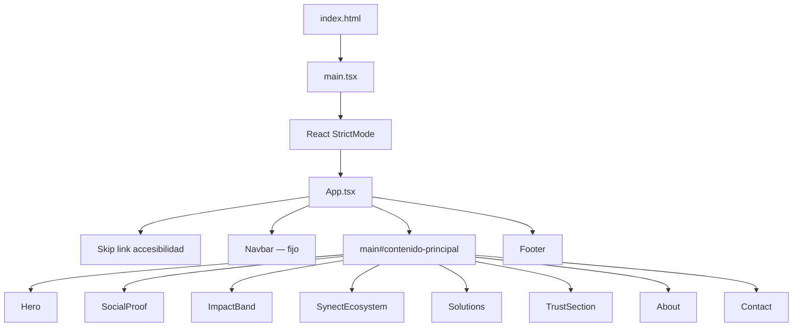
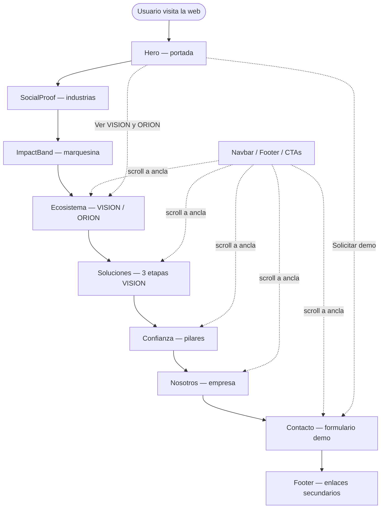
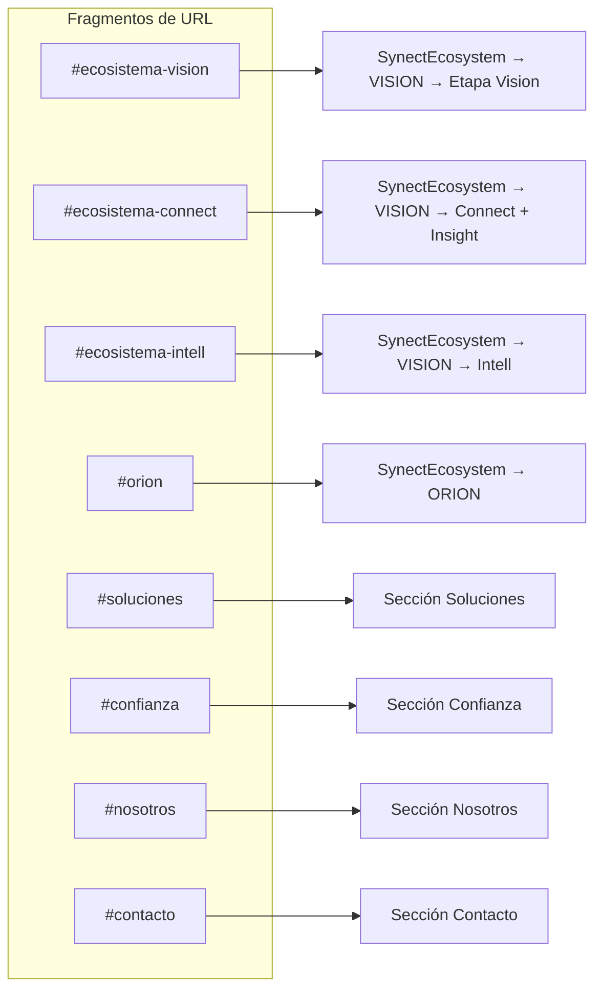
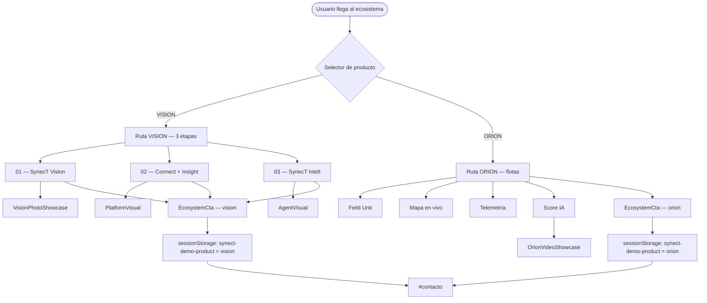
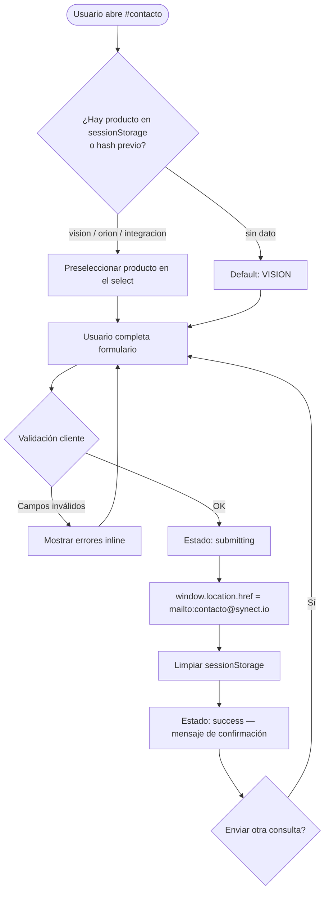
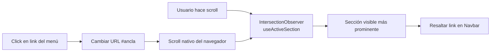
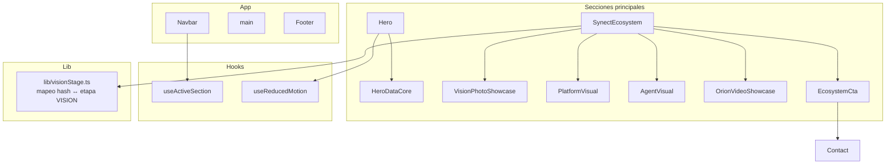
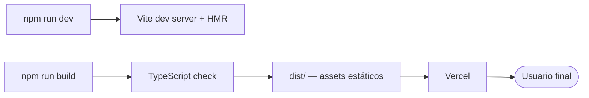

# Diagrama de flujo — Web SynecT

Documento de referencia del flujo de la landing page de SynecT: arquitectura técnica, navegación del usuario e interacciones principales.

---

## 1. Resumen

| Aspecto | Detalle |
|---------|---------|
| **Tipo** | Single Page Application (SPA) — una sola página con scroll vertical |
| **Stack** | React 19 + TypeScript + Vite + Tailwind CSS + Framer Motion |
| **Routing** | Navegación por anclas (`#sección`) — sin React Router |
| **Despliegue** | Vercel (build estático desde `dist/`) |
| **Objetivo** | Presentar VISION y ORION, generar leads vía formulario de contacto |

---

## 2. Arranque de la aplicación



**Flujo técnico:**

1. El navegador carga `index.html` y monta React en `#root`.
2. `main.tsx` renderiza `<App />` dentro de `StrictMode`.
3. `App.tsx` compone todas las secciones en orden vertical fijo.
4. No hay rutas dinámicas: toda la experiencia ocurre en una sola URL base.

---

## 3. Flujo de navegación del usuario

La web es una landing de scroll continuo. El usuario entra por la URL principal y recorre las secciones de arriba hacia abajo, o salta directamente a una sección mediante enlaces con hash.



### Secciones y anclas

| Orden | Componente | ID de sección | Contenido principal |
|-------|------------|---------------|---------------------|
| — | Navbar | — | Menú fijo + CTA "Solicitar demo" |
| 1 | Hero | — | Propuesta de valor, CTAs principales |
| 2 | SocialProof | — | Industrias objetivo |
| 3 | ImpactBand | — | Marquesina animada de keywords |
| 4 | SynectEcosystem | `ecosistema` | Selector VISION / ORION |
| 5 | Solutions | `soluciones` | Tarjetas de las 3 etapas VISION |
| 6 | TrustSection | `confianza` | Pilares de confianza |
| 7 | About | `nosotros` | Quiénes somos |
| 8 | Contact | `contacto` | Formulario de demo |
| — | Footer | — | Enlaces y copyright |

---

## 4. Navegación por hash (anclas)

La URL puede incluir un fragmento (`#sección`) que controla el scroll y, en algunos casos, el estado interno de componentes.



### Hashes del ecosistema

| Hash | Producto | Etapa VISION |
|------|----------|--------------|
| `#ecosistema-vision`, `#vision` | VISION | SynecT Vision (01) |
| `#ecosistema-connect`, `#connect` | VISION | Connect + Insight (02) |
| `#ecosistema-intell`, `#intell` | VISION | SynecT Intell (03) |
| `#orion` | ORION | — |
| `#ecosistema` | VISION | SynecT Vision (por defecto) |

**Comportamiento:**

- Al cambiar el hash, `SynectEcosystem` escucha el evento `hashchange` y actualiza producto/etapa.
- Los hashes del ecosistema provocan scroll automático a `#ecosistema`.
- Al seleccionar tabs dentro del ecosistema, se actualiza la URL con `history.replaceState` (sin recargar la página).

---

## 5. Flujo del ecosistema (VISION / ORION)



### Ruta VISION (progresiva)

```
SynecT Vision  →  Connect + Insight  →  SynecT Intell
  (adquisición)      (datos + KPIs)        (IA predictiva)
```

### Ruta ORION (flotas)

```
Field Unit  →  Mapa en vivo  →  Telemetría  →  Score IA
  (hardware)    (tracking)       (datos)        (IA)
```

---

## 6. Flujo del formulario de contacto

El formulario no envía datos a un backend: valida en el cliente y abre el cliente de correo del usuario (`mailto:`).



### Campos del formulario

| Campo | Validación |
|-------|------------|
| Nombre | Obligatorio |
| Email | Obligatorio + formato válido |
| Empresa / Industria | Obligatorio |
| Producto de interés | Obligatorio (VISION, ORION, Integración PLCs, Otro) |
| Mensaje | Obligatorio |

### Preselección de producto

1. **sessionStorage** (`synect-demo-product`): se guarda al hacer clic en "Solicitar demo VISION/ORION" desde el ecosistema.
2. **Hash de URL**: `#orion` → ORION; `#ecosistema*` o `#vision` → VISION.

---

## 7. Navbar y detección de sección activa



**Links del Navbar:**

| Label | Hash | Sección observada |
|-------|------|-------------------|
| VISION | `#ecosistema-vision` | `ecosistema` |
| ORION | `#orion` | `ecosistema` |
| Soluciones | `#soluciones` | `soluciones` |
| Confianza | `#confianza` | `confianza` |
| Nosotros | `#nosotros` | `nosotros` |
| Contacto | `#contacto` | `contacto` |

En móvil, el menú hamburguesa bloquea el scroll del body mientras está abierto.

---

## 8. Arquitectura de componentes



### Hooks personalizados

| Hook | Uso |
|------|-----|
| `useActiveSection` | Detecta qué sección está visible para resaltar el menú |
| `useReducedMotion` | Respeta preferencias de accesibilidad (reduce animaciones en Hero) |

---

## 9. Puntos de conversión (CTAs)

Todos los caminos de conversión llevan al formulario de contacto o a un `mailto:` directo.

```mermaid
flowchart LR
    H1[Hero — Solicitar demo] --> CON[#contacto]
    H2[Hero — Ver VISION y ORION] --> ECO[#ecosistema-vision]
    N1[Navbar — Solicitar demo] --> CON
    E1[EcosystemCta VISION/ORION] -->|+ sessionStorage| CON
    S1[Soluciones — Ver etapa X] --> ECO2[Hash etapa VISION]
    F1[Footer — Contacto] --> CON
    F2[Footer — mailto directo] --> MAIL[contacto@synect.io]
    CON --> MAIL
```

---

## 10. Build y despliegue



---

## 11. Mapa visual simplificado (recorrido típico)

```
┌─────────────────────────────────────────────────────────────┐
│  NAVBAR  [VISION] [ORION] [Soluciones] ... [Solicitar demo] │
├─────────────────────────────────────────────────────────────┤
│  HERO          Propuesta de valor + CTAs                    │
├─────────────────────────────────────────────────────────────┤
│  SOCIAL PROOF  Industrias objetivo                          │
├─────────────────────────────────────────────────────────────┤
│  IMPACT BAND   Marquesina de keywords                       │
├─────────────────────────────────────────────────────────────┤
│  ECOSISTEMA    ┌─────────┬─────────┐                        │
│                │ VISION  │  ORION  │  ← tabs                 │
│                └────┬────┴────┬────┘                        │
│                     │         │                             │
│              3 etapas    Flota + mapa                       │
│              + demo CTA  + demo CTA                         │
├─────────────────────────────────────────────────────────────┤
│  SOLUCIONES    Vision → Connect+Insight → Intell            │
├─────────────────────────────────────────────────────────────┤
│  CONFIANZA     Pilares + testimonio                         │
├─────────────────────────────────────────────────────────────┤
│  NOSOTROS      Historia y equipo                            │
├─────────────────────────────────────────────────────────────┤
│  CONTACTO      Formulario → mailto                          │
├─────────────────────────────────────────────────────────────┤
│  FOOTER        Enlaces + copyright                          │
└─────────────────────────────────────────────────────────────┘
```

---

## 12. Archivos clave

| Archivo | Responsabilidad |
|---------|-----------------|
| `src/main.tsx` | Punto de entrada React |
| `src/App.tsx` | Composición de secciones |
| `src/components/Navbar.tsx` | Navegación y menú móvil |
| `src/components/SynectEcosystem.tsx` | Lógica VISION/ORION y tabs |
| `src/components/Contact.tsx` | Formulario y flujo mailto |
| `src/components/EcosystemCta.tsx` | CTA con preselección de producto |
| `src/lib/visionStage.ts` | Mapeo hash ↔ etapas VISION |
| `src/hooks/useActiveSection.ts` | Sección activa en scroll |

---

*Generado a partir del código fuente del repositorio Web_SynecT.*
